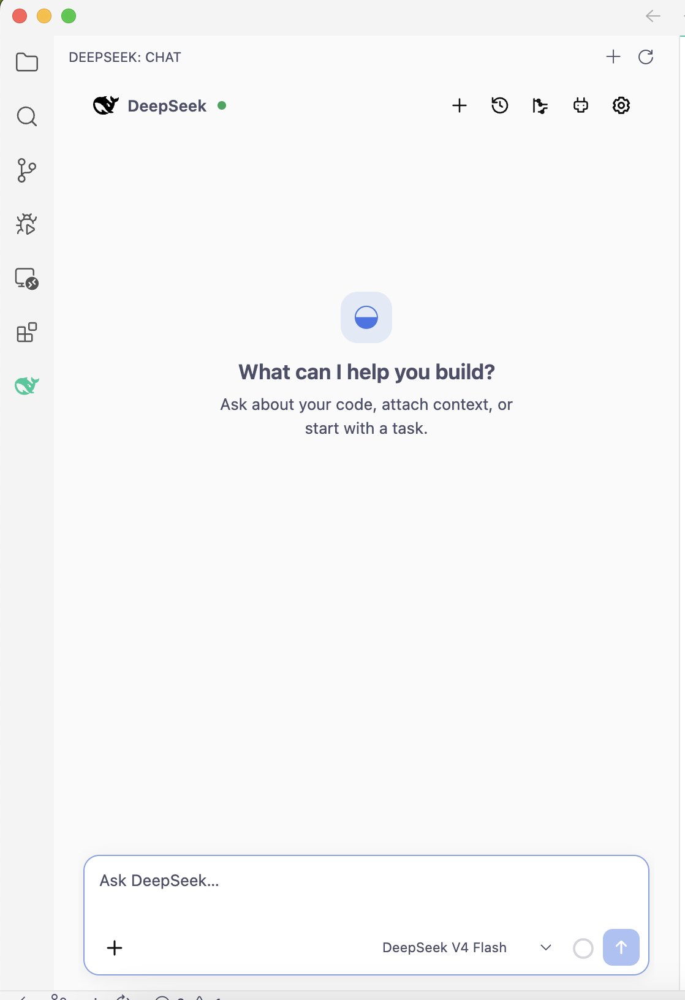
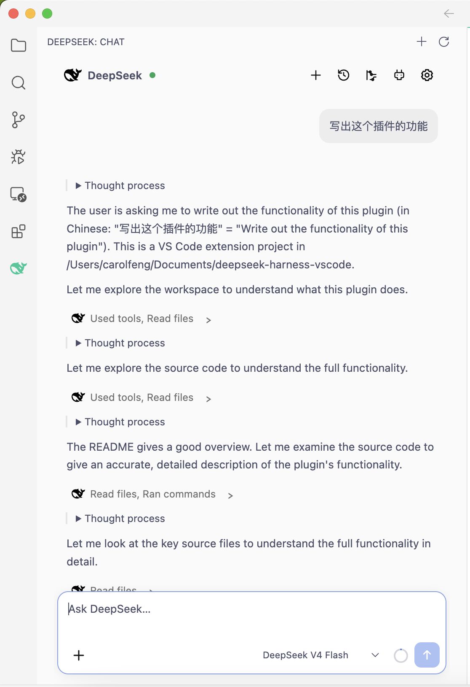
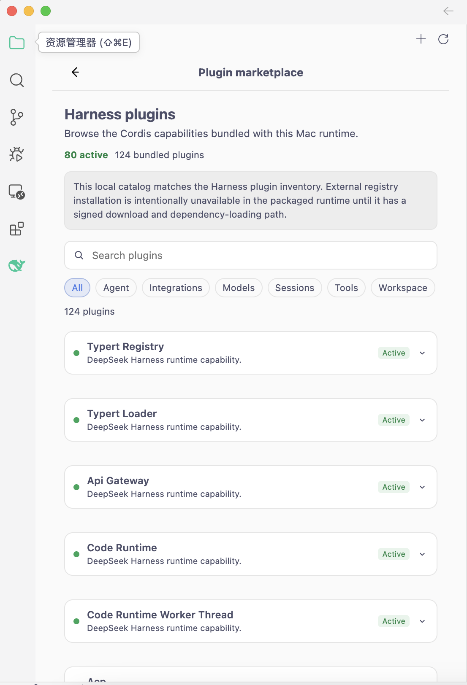

# DeepSeek Harness VS Code

DeepSeek Harness 的 VS Code 客户端。它把 Harness Web 界面以紧凑的形式搬进 VS Code 侧边栏，同时把「智能体循环、工具调用、沙箱、模型访问、凭据和持久化」这些核心能力完整保留在原生 `dsh` 运行时中。

扩展自身只负责：编辑器上下文采集、会话选择、审批交互、以及结果展示。`dsh --profile sdk` 才是 agent 循环、工具、持久化、模型访问和沙箱的唯一所有者。

---

## 目录

- [功能特性](#功能特性)
- [架构概览](#架构概览)
- [技术栈](#技术栈)
- [前置要求](#前置要求)
- [开发环境搭建](#开发环境搭建)
- [构建与打包](#构建与打包)
- [安装](#安装)
- [配置 API Key](#配置-api-key)
- [扩展配置项](#扩展配置项)
- [运行时兼容性](#运行时兼容性)
- [安全模型](#安全模型)
- [项目结构](#项目结构)
- [测试](#测试)
- [相关文档](#相关文档)

---

## 功能特性

- **侧边栏聊天**：在 VS Code Activity Bar 中打开 DeepSeek 图标即可进入 Chat 视图。
- **会话管理**：新建会话、恢复历史会话、Fork 会话（含分支标记与恢复）。
- **增量渲染**：流式输出 assistant 内容，实时展示推理过程与工具调用/结果，推理过程以可折叠的 Thought process 区块呈现。
- **插件市场**：浏览运行时内嵌的 Harness 插件目录，支持按类别筛选与关键词搜索，实时展示插件激活状态。
- **轨迹回放**：按回合与步骤回放完整执行轨迹（模型步骤、工具调用、耗时），支持一键导出。
- **斜杠命令菜单**：运行时提供的可搜索命令菜单，命令结果可渲染。
- **Goal 控制**：目标展示与编辑控制。
- **文件审查**：对模型改动提供 keep / revert 操作。
- **审批流程**：高风险操作弹出审批卡片，支持「允许一次 / 拒绝」。
- **编辑器上下文**：自动携带当前文件路径、光标、选区、打开的标签页、诊断信息、Git diff 以及显式附件。
- **凭据安全**：API key 只写入运行时凭据存储，绝不同步到 Webview。

---

## 项目截图

<table>
  <tr>
    <td align="center" width="50%"><br/><b>Chat 视图</b><br/>欢迎空状态、模型选择与附件入口</td>
    <td align="center" width="50%"><br/><b>思考过程</b><br/>流式对话与可折叠的 Thought process 推理展示</td>
  </tr>
  <tr>
    <td align="center" width="50%"><br/><b>Plugins 视图</b><br/>浏览运行时内嵌的 Harness 插件目录、激活状态与搜索筛选</td>
    <td align="center" width="50%"><br/><b>Trajectory 视图</b><br/>按回合与步骤回放完整执行轨迹，支持导出</td>
  </tr>
</table>

---

## 架构概览

```
Developer ──> VS Code Webview ──> Extension Host ──> DeepSeek Harness Runtime (dsh)
```

- **Webview（React）**：纯展示层与用户意图输入，无 Node.js 能力。
- **Extension Host（TypeScript）**：VS Code API 调用、只读上下文采集、子进程生命周期管理。**不执行模型生成的命令**。
- **Harness Runtime（Python）**：工具调用、文件系统变更、shell 执行、沙箱、审批、凭据、会话持久化、模型访问。

三者之间通过两层边界通信：

1. Webview ↔ Extension Host：类型安全的 `postMessage`（封闭的 TypeScript 联合类型）。
2. Extension Host ↔ Runtime：stdio 上的换行分隔 JSON-RPC 2.0。

详细的容器图、时序图与模块划分见 [docs/ARCHITECTURE.md](docs/ARCHITECTURE.md)。

---

## 技术栈

| 层 | 技术 |
|---|---|
| Extension Host | TypeScript、VS Code Extension API、esbuild |
| Webview | React 18、TypeScript、Vite、react-markdown |
| Runtime | Python 3、asyncio、DeepSeek Harness 插件图 |
| 传输 | JSON-RPC 2.0，stdio 上每行一个 UTF-8 对象 |
| 持久化 | Harness 会话仓库，位于 `~/.dsh` |
| 凭据 | Harness `CredentialRegistry`，owner-only 的 `.credentials.yaml` |

---

## 前置要求

- VS Code `^1.96.0`
- Node.js 20+
- npm

支持平台：

| 平台 | 目标 |
|---|---|
| macOS Apple Silicon | `darwin-arm64` |
| macOS Intel | `darwin-x64` |
| Windows x64 | `win32-x64` |
| Linux x64 | `linux-x64` |

> 每个平台都内嵌对应架构的原生 `dsh` 运行时及其辅助程序。GitHub Actions 在对应系统和 CPU 架构上构建各平台产物（见 [.github/workflows/build.yml](.github/workflows/build.yml)）。

---

## 开发环境搭建

```bash
cd deepseek-harness-vscode
npm install
npm run typecheck   # 类型检查
npm run build       # 构建扩展 + Webview
```

然后在 VS Code 中打开本目录，按 `F5` 启动 Extension Development Host 调试扩展。

> 可在 VS Code 设置中配置 `deepseekHarness.runtime.command`，使用自行构建的 `dsh` 运行时替代扩展内置版本。

### 常用脚本

| 命令 | 说明 |
|---|---|
| `npm run typecheck` | TypeScript 类型检查（`tsc --noEmit`） |
| `npm run build` | 依次构建扩展与 Webview |
| `npm run build:extension` | 仅构建扩展（esbuild → `dist/extension.cjs`） |
| `npm run build:webview` | 仅构建 Webview（Vite） |
| `npm test` | 运行 Vitest 测试套件 |
| `npm run package:darwin-arm64` | 构建并打包 `darwin-arm64` VSIX |
| `npm run package:darwin-x64` | 构建并打包 `darwin-x64` VSIX |
| `npm run package:win32-x64` | 构建并打包 `win32-x64` VSIX |
| `npm run package:linux-x64` | 构建并打包 `linux-x64` VSIX |

---

## 构建与打包

### 方式一：GitHub Actions 自动构建（推荐）

推送 `v*` 标签（或手动触发 workflow）后，[`.github/workflows/build.yml`](.github/workflows/build.yml) 会在四个目标 runner 上分别构建对应架构的原生 `dsh` 运行时，并打包出四个平台的 VSIX。推送 tag 时还会自动创建 GitHub Release 并上传全部产物。

原生依赖必须在对应系统和 CPU 架构上构建，因此推荐使用 CI 完成多平台打包。

### 方式二：本地打包当前平台

```bash
npm install
npm run package:darwin-arm64   # 或 darwin-x64 / win32-x64 / linux-x64
```

> 本地打包只会在当前系统上产出对应平台的 VSIX。例如在 Apple Silicon Mac 上执行 `npm run package:darwin-arm64`，产物为 `deepseek-harness-vscode-darwin-arm64-<version>.vsix`，内嵌 PyInstaller 打包的 `arm64` 运行时可执行文件。要打包其他平台，请改用 CI 或到对应系统上执行。

---

## 安装

### 方式一：从 GitHub Release 下载（推荐）

1. 前往 [Releases 页面](https://github.com/yushenghai1106/deepseek-harness-vscode-sidebar/releases)，按你的系统下载对应平台的 `.vsix` 文件：
   - macOS Apple Silicon：`deepseek-harness-vscode-darwin-arm64-*.vsix`
   - macOS Intel：`deepseek-harness-vscode-darwin-x64-*.vsix`
   - Windows x64：`deepseek-harness-vscode-win32-x64-*.vsix`
   - Linux x64：`deepseek-harness-vscode-linux-x64-*.vsix`
2. 在 VS Code 中打开扩展视图（Extensions）。
3. 点击右上角 `…` → **Install from VSIX…**，选择刚下载的 `.vsix` 文件。
4. 安装完成后重载 VS Code。
5. 点击 Activity Bar 中的 **DeepSeek** 图标，在 Chat 视图的设置按钮中配置 API key。

### 方式二：本地构建打包

在当前系统上从源码构建并打包（仅产出当前平台产物）：

```bash
npm install
npm run package:darwin-arm64
```

随后按「方式一」的第 2–5 步安装即可。

---

## 配置 API Key

API key 的存放与读取完全由 Harness 运行时管理，扩展不直接接触密钥内容。

### 存放位置

密钥存储在 **`~/.dsh/.credentials.yaml`**（用户主目录下，不在项目仓库内），目录权限 `0700`、文件权限 `0600`（仅当前用户可读写）。

该目录与 Web 版 Harness 共享，因此在 Web 界面配置过的 key 可被扩展直接复用。

### 配置方式

1. **设置面板**：Chat 视图 → 设置 → API Key 输入框。提交后 key 经 `credentials/set` 一次性转发给运行时存储。
2. **环境变量**：扩展宿主环境中的 `DEEPSEEK_API_KEY`。此方式下 key 为只读（设置面板中 `writable` 为 `false`），无法被存储值覆盖。

### 安全保证

密钥绝不会：

- 通过任何状态 API 返回；
- 存入 Webview 状态、扩展全局状态或 VS Code 设置；
- 加入会话事件或模型上下文；
- 写入扩展 / 运行时的诊断日志。

UI 状态仅包含 `configured`、`writable` 与 `source` 等非密元数据。详见 [docs/SECURITY_MODEL.md](docs/SECURITY_MODEL.md)。

---

## 扩展配置项

以下配置均位于 VS Code 设置的 `DeepSeek Harness` 分组下（`deepseekHarness.*`）：

| 配置项 | 类型 | 默认值 | 说明 |
|---|---|---|---|
| `runtime.command` | string | `""` | Python 运行时可执行文件。留空则使用扩展自带的运行时。 |
| `runtime.arguments` | array | `["sdk"]` | 运行时参数。 |
| `dataDir` | string | `""` | Harness 主目录。默认 `~/.dsh`，与 Web 版共享 key 与会话。 |
| `sessionCompression` | enum | `zstd` | 会话日志压缩方式（`zstd` / `none`）。 |
| `provider` | string | `deepseek-official` | 模型提供商。 |
| `model` | string | `deepseek-v4-flash` | 模型名称。 |
| `endpoint` | string | `""` | 可选的自定义 API 端点，留空使用提供商默认值。 |
| `permissionMode` | enum | `workspace-write` | 文件系统权限策略（`read-only` / `workspace-write` / `danger-full-access`）。 |
| `context.includeDiagnostics` | boolean | `true` | 是否携带编辑器诊断信息。 |
| `context.includeGitDiff` | boolean | `true` | 是否携带 Git diff。 |

---

## 运行时兼容性

- Harness 包：`deepseek-harness-python` 0.1.0
- Harness 仓库基线 commit：`b659117aaf78c6103ed1bec32dce5b7915320445`（加上本工作区的 SDK 协议补充）
- SDK 协议身份：`deepseek-harness-sdk-runtime` 0.1.0
- 扩展版本：0.1.1

---

## 安全模型

Harness 运行时是工作区访问、工具执行、沙箱策略、审批、模型访问、会话与凭据的权威来源。

| 能力 | 策略 |
|---|---|
| 读 | 按 Harness 策略允许 |
| 写 | 由 Harness 工作区沙箱强制约束 |
| 执行 | 需要时由 Harness 请求审批 |
| 破坏性操作 | Harness 请求审批，未应答时 fail-closed |

- Webview 无 Node.js 访问能力，不能读文件、执行 shell 或直接调用 Harness。
- Extension Host 不执行模型生成的命令，也不应用模型生成的补丁，这些操作均属于 Harness 工具。
- 编辑器上下文大小受限：显式附件每项 ≤ 96 KiB，Git diff ≤ 64 KiB，诊断条目 ≤ 100 条。

详见 [docs/SECURITY_MODEL.md](docs/SECURITY_MODEL.md)。

---

## 项目结构

```
src/
├── runtime/     # 进程生命周期、状态、重启序列化、运行时环境
├── harness/     # 稳定适配器、JSON-RPC 客户端、原生事件映射
├── context/     # 编辑器/选区/诊断/Git/附件 的只读采集
├── views/       # VS Code/Webview 编排、会话展示状态、审批与设置意图
├── webview/     # 纯 React 展示与用户意图
└── shared/      # 跨 Webview 边界的封闭消息与事件联合类型
```

---

## 测试

```bash
npm test
```

测试使用 Vitest，包含单元测试与集成测试。集成测试通过环境变量 `DSH_E2E_API_KEY` 注入密钥，**不会**硬编码任何真实凭据。

---

## 相关文档

- [中文使用指南](docs/USER_GUIDE_CN.md)
- [架构](docs/ARCHITECTURE.md)
- [运行时协议](docs/RUNTIME_PROTOCOL.md)
- [安全模型](docs/SECURITY_MODEL.md)
- [会话事件模型](docs/SESSION_EVENT_MODEL.md)
- [运行时边界 ADR](docs/ADR-0001-RUNTIME-BOUNDARY.md)
- [仓库分析](REPOSITORY_ANALYSIS.md)
