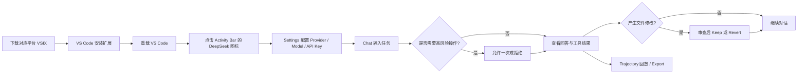

# DeepSeek Harness VS Code 使用指南

> 将 Harness Web 能力带入 VS Code 侧边栏，让你在熟悉的编辑器里完成对话、代码理解、工具调用和变更审查。

## 一、项目能解决什么问题？

DeepSeek Harness VS Code 是一个 VS Code 客户端扩展。它把 Chat 界面放进 Activity Bar，同时由 `dsh-py` 运行时负责智能体循环、工具、沙箱、模型访问、审批、会话持久化和凭据管理。

## 二、主要优点

| 优点 | 说明 |
| --- | --- |
| **编辑器内完成工作** | 不用切换浏览器，可直接在 VS Code 侧边栏聊天并结合当前代码工作。 |
| **上下文更完整** | 可自动携带当前文件、光标、选区、已打开标签页、诊断信息、Git diff 和显式附件。 |
| **过程透明可追踪** | 流式显示回答、思考过程、工具调用和工具结果；Trajectory 视图还能按回合回放并导出。 |
| **会话可持续** | 支持新建、恢复历史会话和 Fork 分支，适合连续处理复杂任务。 |
| **变更可控** | 模型修改文件后可选择 keep 或 revert；高风险操作会先弹出审批卡片。 |
| **安全边界清晰** | Webview 不读文件、不执行 shell；模型生成的命令由 Harness 运行时执行，并受沙箱和审批策略约束。 |
| **密钥不暴露** | API Key 由 Harness 凭据存储管理，不进入 Webview、会话记录、模型上下文或诊断日志。 |
| **跨平台支持** | README 声明支持 macOS Apple Silicon、macOS Intel、Windows x64 和 Linux x64，并提供对应 VSIX。 |

## 三、整体操作流程



## 四、安装步骤

### 方式 A：从 GitHub Release 安装（推荐）

1. 打开项目的 [Releases 页面](https://github.com/YSH-Forts/deepseek-harness-vscode-sidebar/releases)。
2. 按电脑平台下载对应的 `.vsix`：
   - Apple Silicon：`deepseek-harness-vscode-darwin-arm64-*.vsix`
   - Intel Mac：`deepseek-harness-vscode-darwin-x64-*.vsix`
   - Windows x64：`deepseek-harness-vscode-win32-x64-*.vsix`
   - Linux x64：`deepseek-harness-vscode-linux-x64-*.vsix`
3. 打开 VS Code 的 **Extensions** 视图。
4. 点击右上角 `…` → **Install from VSIX…**，选择下载的文件。
5. 安装完成后点击 **Reload**，然后在 Activity Bar 点击 **DeepSeek** 图标。

### 方式 B：从源码构建

适合开发者或需要本地修改项目的场景：

```bash
npm install
npm run typecheck
npm run build
npm run package:darwin-arm64   # 按当前平台替换
```

> 在 IDE 内打包时（不经过 `--target` 脚本）需先执行 `npm run runtime:sync`，把运行时整理为扩展期望的 `bin/dsh/dsh` 布局。

本地打包只生成当前系统对应的 VSIX。其他平台需要在对应系统构建，或使用 GitHub Actions。

## 五、首次配置 API Key

1. 打开 **DeepSeek → Chat**。
2. 点击 Chat 顶部的设置按钮，进入 **Settings**。
3. 在 **Models** 区域确认 Provider 和 Model。
4. 在 **API Key** 输入框填写密钥。
5. 点击 **Save changes**。
6. 返回 Chat，即可开始提问。


### 密钥安全说明

- 密钥默认保存在 `~/.dsh/.credentials.yaml`，目录权限为 `0700`，文件权限为 `0600`。
- 也可以通过扩展宿主环境变量 `DEEPSEEK_API_KEY` 提供密钥；此时密钥为只读。
- 密钥不会写入 VS Code 设置、Webview 状态、聊天历史、模型上下文或日志。
- 如果 Web 版 Harness 已经配置过同一密钥，扩展可以复用共享的 Harness 凭据存储。

## 六、如何使用 Chat

1. 在输入框描述任务，例如“帮我分析这个插件项目的架构”。
2. 使用 `+` 添加显式附件；扩展也会根据设置自动携带编辑器上下文。
3. 发送后，等待 Chat 流式展示回答。
4. 展开 **Thought process** 查看过程信息，点击工具调用条目查看工具名称和结果。
5. 需要继续时直接在输入框补充要求；需要新任务时点击新建会话。


### 可用的编辑器上下文

扩展可以携带：当前文件路径、光标位置、选区、打开的标签页、诊断信息、Git diff 和显式附件。上下文设置可在 VS Code 设置中调整：

- `deepseekHarness.context.includeDiagnostics`
- `deepseekHarness.context.includeGitDiff`

## 七、审批与文件修改

当任务需要执行高风险操作时，Harness 会弹出审批卡片：

- **允许一次**：只批准当前一次操作。
- **拒绝**：阻止该操作，智能体会收到拒绝结果。

如果模型修改了文件，请在结果中检查差异，再选择：

- **Keep**：保留修改。
- **Revert**：撤销修改。

权限模式可在 Settings 中选择：

- `read-only`：只读访问。
- `workspace-write`：允许写入工作区，默认模式。
- `danger-full-access`：完整访问，使用前应谨慎确认。

## 八、会话管理与执行回放

Chat 顶部支持：

- 新建会话；
- 恢复历史会话；
- Fork 会话并保留分支标记。

打开 **Trajectory** 后，可以看到完整执行轨迹，包括回合、模型步骤、系统提示、assistant response、工具调用和工具结果；点击 **Export** 可导出轨迹。


## 九、常用配置

在 VS Code 设置的 **DeepSeek Harness** 分组中，可调整：

| 配置项 | 用途 |
| --- | --- |
| `deepseekHarness.provider` | 模型提供商，默认 `deepseek-official` |
| `deepseekHarness.model` | 模型名称，默认 `deepseek-v4-flash` |
| `deepseekHarness.endpoint` | 自定义 API Endpoint，可留空 |
| `deepseekHarness.permissionMode` | 文件访问与执行权限策略 |
| `deepseekHarness.dataDir` | Harness 数据目录，默认 `~/.dsh` |
| `deepseekHarness.sessionCompression` | 会话日志压缩方式，`zstd` 或 `none` |
| `deepseekHarness.runtime.command` | 自定义 `dsh-py` 可执行文件路径 |

## 十、开发者验证

修改源码后可运行：

```bash
npm run typecheck
npm run build
npm test
```

在 VS Code 中打开项目目录并按 `F5`，即可启动 Extension Development Host 调试扩展。

## 十一、快速上手清单

- [ ] 下载与系统匹配的 VSIX
- [ ] 在 Extensions 中安装并重载 VS Code
- [ ] 点击 Activity Bar 的 DeepSeek 图标
- [ ] 在 Settings 配置 API Key、模型和权限模式
- [ ] 在 Chat 输入任务并查看流式结果
- [ ] 对高风险操作进行允许或拒绝
- [ ] 对文件修改执行 Keep 或 Revert
- [ ] 需要复盘时打开 Trajectory 并 Export

